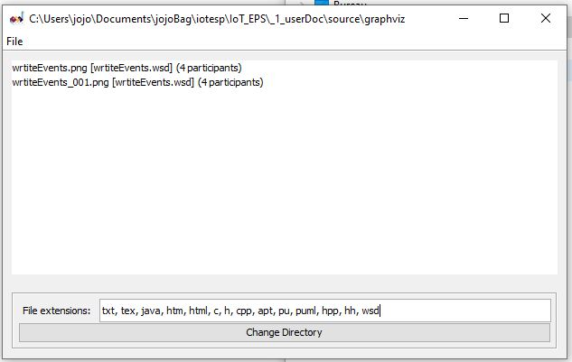

.. index::
    single: C++; Notes C++

++++++++++++++++++++++++++++++++
Mes notes sur C++
++++++++++++++++++++++++++++++++

:Auteur: J.Soranzo
:Date: Novembre 2019
:Update: 15/03/2023
:Societe: VoRoBoTics
:Entity: VoLAB

.. contents::
    :backlinks: top

.. toctree::
   :maxdepth: 2
   :caption: Sous-articles:

   /C++/visualCpp/visual
   /C++/Qt/Qt

Ceci n'est pas un cours sur le C++, il y en a déjà plein et de très bons voir celui par exemple de
`Openclassrooms`_

.. _`Openclassrooms` : https://openclassrooms.com/fr/courses/1894236-programmez-avec-le-langage-c

**Voir aussi la map cpp_notes.xmind**

====================================================================================================
Codding Styles/ formatting
====================================================================================================

`Google C++ Style Guide`_

.. _`Google C++ Style Guide` : https://google.github.io/styleguide/cppguide.html

Dans Vscode::

    C_Cpp.clang_format_fallbackStyle = { BasedOnStyle: Google, IndentWidth: 4 }

====================================================================================================
C++ opérateurs (surcharge)
====================================================================================================
Même si l'on parle de classe, ceci n'est pas une méthode.
C'est une fonction normale située à l'extérieur de toute classe.

Exemple:

.. code:: cpp

    bool operator==(Durée const& a, Durée const& b);
    
Surcharge opérateur ==, >, ... 
----------------------------------------------------------------------------------------------------
Exemple complet:

.. code:: cpp

    bool Duree::estEgale(const Duree &a) const
    {
    return (m_heures == a.m_heures && m_minutes == a.m_minutes && m_secondes == a.m_secondes );
    }
    
    bool operator==(const Duree &a, const Duree &b)
    {
    return a.estEgale(b);
    }
    
    bool operator!=(const Duree &a, const Duree &b)
    {
    return !(a==b);
    }

.. NOTE::    Attention au mot clé const à la fin de la méthode estEgale !

Surcharge des opérateurs arithmétiques
----------------------------------------------------------------------------------------------------
Exemple avec +, on commence par surcharger l'opérateur de raccourci +=.

Comme il modifie l'objet lui-même cette surcharge est un méthode de l'objet.

.. NOTE::
    La première méthode fonctionnerait très pour la surcharge de l'opérateur +

.. code:: cpp
    
    Duree& Duree::operator+=(const Duree& a)
    {
        // Comme avant... rien à changer ici
        return *this;
    }
    //Cette portion de code vient du site Openclassrooms (licence CC BY,SA) cours C++

.. NOTE::

    return \*this retourne une instance de l'objet !
    
Puis on peut surcharger + avec une fonction classique

.. code:: cpp

    Duree operator+(Duree const& a, Duree const& b)
    {
        Duree copie(a);   //On utilise le constructeur de copie de la classe Duree !
        copie += b;       //On appelle la méthode d'addition qui modifie l'objet 'copie'
        return copie;     //Et on renvoie le résultat. Ni a ni b n'ont changé.
    }
    //Cette portion de code vient du site Openclassrooms (licence CC BY,SA) cours C++

.. WARNING::
    Puisque a est passée sous forme de constante, on ne peut écrire a +=b d'où la copie qui utilise
    le constructeur de copie.
    

Surcharge de l'opérateur <<
----------------------------------------------------------------------------------------------------
Cette surcharge est un peu particulière. On commence, normalement pas créer un méthode dans l'objet

Exemple la méthode affiche()

.. code:: cpp

    void Duree::afficher(ostream &flux) const
    {
        flux << m_heures << "h" << m_minutes << "m" << m_secondes << "s";
    }
    //Cette portion de code vient du site Openclassrooms (licence CC BY,SA) cours C++

puis on surcharge l'opérateur. Presque normalement si ce n'est le flux en entrée et en sortie.

.. code:: cpp

    ostream &operator<<( ostream &flux, Duree const& duree)
    {
        duree.afficher(flux) ;
        return flux;
    }
    //Cette portion de code vient du site Openclassrooms (licence CC BY,SA) cours C++   

----------------------------------------------------------------------------------------------------

.. index::
    pair: C++; Namespace

================================
Namespace
================================
Cela permet de préciser un nom de variable, de clase et/ou de fonction.

Exemple 2 variable/ou fonctions/ ou classe ayant le même nom : rectangle dans 2  couples de 
fichiers .h et .cpp 

Les inclure dans 2 namespaces différents permet de les distinguer au moment de l'appel

namespace1::rectangle();

namespace2::rectangle();

Si on est sur de n'en utiliser qu'un seul dans toute l'appli alors on met::

    using namespace namespace1;

on peut aussi le faire pour un seul élément du namespace (c'est plus précis)::
    
    using namespace1::rectangle()

Il y a une partie déclarative::

    namespace toto{
        int uneFonction(){

        }
    }

et la partie utilisation avec using

ne pas mettre de using namespace dans les .h, en effet c'est un outil pour résoudre des conflits de
nom dans un espace en particuler et comme on ne sait pas à l'avance où vont être inclu les .h
A priori, partout, on risque d'avoir des conflits de noms.

Quelques références:

`Namesspace sur le site Microsoft`_

.. _`Namesspace sur le site Microsoft` : https://docs.microsoft.com/fr-fr/cpp/cpp/namespaces-cpp?view=vs-2019

`Namespace sur developpez.com`_

.. _`Namespace sur developpez.com` : https://cpp.developpez.com/faq/cpp/?page=Les-namespaces

----------------------------------------------------------------------------------------------------

.. index::
    single: C++; Template

================================
Template
================================

Permet de ne pas avoir à réécrire le même code d'une fonction (voir d'une classe entière)
pour différentes classes en argument.

Dès qu'on voit <truc> c'est qu'il doit y avoir du template la dessous.

Exemple : la classe vector peut s'appiquer à différents objets.   

Au niveau syntaxe déclarative, cela se passe comme ceci::

    template<typename T>
    T _functionName( T param1, T param2, _autres param);
    
Template et typename sont des mots clés. T devient le type de variable utilisé dans la fonction.

Il faut que le corps de la fonction soit strictement identique pour tous les objets traités.

Voir l'`exemple de la fonction maximum sur Openclassroom`_

.. _`exemple de la fonction maximum sur Openclassroom` : https://openclassrooms.com/fr/courses/1894236-programmez-avec-le-langage-c/1903999-creez-des-templates

Au niveau appel, on précise à chaque appel de la fonction,
le type qu'on veut utiliser entre < et >::

        _fontion<type_utilisé>(param1, param2, ...)
        
.. WARNING::
    Prototype et corps de la fonction template DOIVENT se trouver dans le .h
    
Spécialisation
----------------------------------------------------------------------------------------------------
Une fois le template créé, on peut le spécialiser pour un type en particulier. Cela permet de
changer le comportement de la focntion pour un type en particulier.

C'est la partie déclarative qui change::

    template<>
    retval _fonctionName<type_particulier>(... puis vient reste de la fonction pour ce type.
    
On note que:
- rien dans template entre < et >
- on précise le type dans le header de la fonction

L'ordre des déclarations est important : d'abord la version générique puis la ou les spécialisations

----------------------------------------------------------------------------------------------------

.. index::
    pair: C++; Statique
    pair: c++; static

================================
Membres statiques
================================
Un attribut statique peut être accédé de l'intérieur comme de l'extérieur de la classe.

Une méthode statique ne peut accéder qu'aux attributs statiques de la classe.

.. WARNING::
    Un membre static doit être initialisé en dehors du fichier .h (dans le .cpp) sans oublier de 
    le faire précédé du nom de la classe.

.. code:: cpp

    bool CRtc::initErr = false;
    NTPClient *CRtc::p_timeClient = nullptr;

----------------------------------------------------------------------------------------------------

.. index::
    pair: C++; Référence

================================
Passage par référence
================================

int fonction( int &variable )

Ne pas confondre avec un pointeur. A l'intérieur de la fonction on utilise seulement le nom de la 
variable passée et en plus pas la syntaxe -> si il s'agit d'un objet.

Mais on modifie bien la variable source puisqu'il n'y a pas de copie.

Voir ci-dessus dans `C++ opérateurs (surcharge)`_

 - ne change rien au niveau de l'appel de la fonction
	- à condition d'un apel avec variable
 - le paramètre doit être un emplacment mémoir modifiable
	- incr10( 20 ); ne marche pas car 20 n'est pas modifiable dans la fonction
	- sauf si on utilise const dans la déclaration : int incr10(const int& num)
	- ou le double déréférencement int incr10(int&& num);
 - ne change rien dans le corps de la fonction
 - Ne pas confondre avec le fait de passer un pointeur à une fonction ( on passe par copie d'un pointeur certe ) 
 - Prototype : int incr10(int& num) noter le &
 - appel : result = incr10(value);

----------------------------------------------------------------------------------------------------

.. index::
    single: C++; Héritage

================================
Héritage
================================
Il y a héritage quand on peut dire : « A est un B ».

Une voiture est un véhicule

un carré est une forme géomètrique

Une fenêtre est un objet graphique

Un bouton est un widget

----------------------------------------------------------------------------------------------------

.. index::
    single: C++; Polymorphisme

================================
Polymorphisme
================================
Dans le cas de l'héritage, c'est quand une méthode d'une classe adapte automatiquement son 
comportement en fonction de la nature de l'objet qui lui est passé.

C'est rendu possible grâce au mot clé virtual (il est nécessaire alors de passer soit un **pointeur
ou une référence**).

On parle aussi de :index:`résolution dynamique de liens`.

Le destructeur doit toujours être virtuel si on utilise le polymorphisme.

`Plus d'informations sur Openclassroom`_

.. _`Plus d'informations sur Openclassroom` : https://openclassrooms.com/fr/courses/1894236-programmez-avec-le-langage-c/1898632-mettez-en-oeuvre-le-polymorphisme#/id/r-1908359

.. index::
    single: C++; Classes et fonctions amies

================================
Classe amie et fonction amie
================================

Une simple fonction peut être déclarée amie d'une classe. L'intérêt qu'elle peut accéder aux 
méthodes privées de la classe.

Le mot clé est friend. Pour une fonction cela donne:

friend *type fonction();* **que l'on place à l'intérieur de la déclaration de la classe**

Pour une classe, il faut indiqué dans le header de quelle classe elle est amie

friend class *monAmie;*

`Exemple sur OCRoom`_

.. _`Exemple sur OCRoom` : https://openclassrooms.com/fr/courses/1894236-programmez-avec-le-langage-c/1898734-utilisez-les-elements-statiques-et-lamitie#/id/r-1908555

----------------------------------------------------------------------------------------------------

.. index::
    single: Vector

================================
Vector
================================

la syntaxe vector<int> tableau(10) permet de créer des tableau dynamique.

.. WARNING:: 

    Ne pas oublier : **#include <vector>**

vector<int> tableau(10, 6) crée un tableau de 10 entiers valant tous 6

vector<int> tableau crée un tableau d'entier vide.

L'accès aux éléments reste classique avec les []

Pour ajouter des éléemtns, on utilise la méthode push_back()

Pour supprimer des éléments, on utilise la méthode pop_back()

Pour connaître la taille, on utilise la méthode size()

Voir sur `vector sur cppreference.com`_ cette classe est beaucoup plus riche.

.. _`vector sur cppreference.com` : https://fr.cppreference.com/w/cpp/container/vector

Une petite paranthèse sur iterator : introduit les fonctions next(), prev(), advance()

#include <iterator> (fait partie de std::)

On pourrait aussi parler de list

#include <list> du std:: aussi

::

    std::list est un conteneur qui permet l'insertion et la suppression rapide d'éléments depuis 
    n'importe quel endroit du conteneur. L'accès rapide à une position aléatoire n'est pas supporté.
    std::list est implémenté comme une liste doublement chaînée.
    
    //from cppreference.com

.. index::
    single: Itérator, Itérer
    
Itérer un tableau rappel
----------------------------------------------------------------------------------------------------
.. code:: cpp
    
    int tableau[] ...
    for (int x : tableau) focntionne
    
    std::vector<int> v = {0, 1, 2, 3, 4, 5};
    for (const int& i : v)  //subtilité &   
    
.. index::
    single: C++; Classe abstraite 

===============================================
Classe abstraite et méthodes virtuelles pures
===============================================
Une classe abstraite est une classe qui contient **au moins** une méthode virtuelle pure.

Une méthode virtuelle pure est une classe virtuelle dont le proto se termine par =0 et qui n'a pas
d'implémentation.

On ne peut pas créer d'instance de classe abstraite mais on peut créer un pointeur sur une classe
abstraite (pour ensuite l'initialiser sur une classe fille).

====================================
Fonctions qui retourne un référence
====================================
::

    returning a reference !
        super puissant !
        cf exemple 13 chapitre 5 du livre Beginning Visual C++® 2013 de Ivor Horton
            Ex5_13_returningReference
            wrox-press-ivor-horton-s-beginning-visual-c-2013-2014.pdf
                dans le bookin les liens vers les sources sont fauts
            page 210
        ne pas confondre return &var; ça ça retourne un pointeur
        type& _fonction(){ return varType; }
            ça ça retourne une référence
            
En quoi cela est-il si puissant ? (25/11/2019)

Le renvoi d'une référence à une valeur depuis une fonction signifie que vous pouvez utiliser le 
résultat de la fonction situé à gauche d'une instruction d'affectation. Cela permet de faire des 
choses impossiblse autrement.

fonction( paramtres ) = valeur;

La fonction retourne une adresse et valeur est sotcké à cette adresse !
Donc oui c'est hyperdangereux !

Never, ever, return a reference to a local variable from a function.

Permet la surcharcharge de l'opérateur = comme dans l'exemle du livre d'Ivor Horton page 342.

----------------------------------------------------------------------------------------------------

.. index::
    single: C++; Constructeur de copie

================================
Constructeur de copie
================================

Comme le :index:`constructeur` par défaut, tout compilateur qui se respect crée automatiquement 
un :index:`constructeur de copie`. Ainsi qu'un opérateur d'affectation par défaut qui peut être très 
dangereux pour des objets qui affecte de la memoire dynamique à leur attributs !

.. code:: cpp

    class MaClasse 
    { 
    public: 
        MaClasse( const MaClasse & ); // ceci est le constructeur de copie 
    };

Cas des objets à allocation de mémoire dynamique. En d'autres termes ceux qui ont des **attrributs
sous forme de pointeurs**. Il est alors **nécessaire** de faire cette surcharge pour ne pas que les
2 objets (la copie et le copié) pointent sur le même objet attribut.

.. code:: cpp

    //constructeur de copie
    Personnage::Personnage(const Personnage &personnageACopier): m_vie(personnageACopier.m_vie), m_mana(personnageACopier.m_mana), marme(0)
    {
       // m_arme = new Arme(personnageACopier.m_arme); // utilisation du constructeur de copie de la classe Arme
       //balaise !!!!!!!!!!!!!!!!!!!!!!!!!!!!!!!!!!!!!!!!!!!!!!!!!!!!!!!!!!!!!!!!!!!!!!!!!!!!!!!!!!!!!!!!!!!!
       //presque sauf que m_arme est un pointeur et que sont constructeur de copie attend en entrée un objet pas un pointeur !
       //Donc la syntaxe correcte est :
       m_arme = new Arme( *(personnageACopier.m_arme) );
       //super balaise !!!!!!!!!!!!!!!!!!!!!!!!!!!!!!!!!!!!!!!!!!!!!!!!!!!!!!!!!!!!!!!!!!!!!!!!!!!!!!!!!!!!!!
       // personnageAcopier.m_arme est une adresse
       // *personnageAcopier.m_arme est une instance !!!!!!!!!!!!!!!!!!!!!!!!!!
      
    }
    //Cette portion de code vient du site Openclassrooms (licence CC BY,SA) cours C++
    //Sauf les commentaires !

Surcharge de l'opérateur =     
----------------------------------------------------------------------------------------------------
Si il s'avère nécessaire de surcharger l'opérateur de copie, c'est qu'il est nécessaire de le faire
également pour l'opérateur =

.. code:: cpp

    Classe& Classe::operator=(Classe const& objetACopier) 
    {
        if(this != &objetACopier)
        //On vérifie que l'objet n'est pas le même que celui reçu en argument
        {
            attribut1 = objetACopier.attribut1; //Copie des attributs non pointeurs
            attribut2 = ... ;
            delete attributPointeur1;
            attributPointeur1 = new ClassAttributPointeur1(*(objetACopier.attributPointeur1));
            //idem pour les autres attributs pointeurs
            
        }
        return *this; //On renvoie l'objet lui-même
    } 

----------------------------------------------------------------------------------------------------    
    
.. index::
    single: Programmation; printf

================================
printf format
================================
Format utilisable dans les :index:`printf`

%05d pour un entier signé précédé de 0

%05lu entier long non signé précédé de 0

autres possibilitées : les fonctions du style ultoa()

%c : pour que cela fonctionne bie, il faut que la chaine soit de la forme 'x' et pas "x" au moins
dans le monde ARDUINO

.. index::
    single: C++; typedef and co

================================
Typedef, struct & co
================================
Typedef 
----------------------------------------------------------------------------------------------------
typedef *type_connu nouveau_nom*; **Alternative C++11** : using _newName = _oldType ;

struct
----------------------------------------------------------------------------------------------------

.. code:: cpp

    struct _structName { _elelments; };
        
Utilisation : struct _structName _variableName;

on peut également combiné la création de la structure avec celle d'une varaible et sont init 
comme dans:

.. code:: cpp

    struct temps {
    unsigned heures;
    unsigned minutes;
    double secondes;
    } t1 = { 1, 45, 30.560 };

Dans ce cas si on ne le réutilise pas on peut omettre le nom de la structure.

Avec un typedef cela donne:

.. code:: cpp
   
    typedef struct _structName _aliasName;
    _aliasName _variable;

Plus besoin de mettre struct devant. On peut également combiner le typedef avec la déclaration

typedef struct _structName{ _elements; } _aliasName ;

Je crois même que dans ce cas on peut omettre le nom de la structure. oui: vérifié sur une compile
arduino

.. code:: cpp

    struct point {
        int x;
        int y ;
    };
    typedef point point_T;
    point_T monPoint;

    typedef struct { int x; int y; } autrePoint_T;
    autrePoint_T deuxeimePoint;

enum 
----------------------------------------------------------------------------------------------------
Même schéma que struct

		enum _enumName { _elements;  };

typedef et les fonctions 
----------------------------------------------------------------------------------------------------        
typedef pour déclarer des profile de fonction (souvent avec des pointeur sur fonction):

.. code:: cpp

    typedef int (*t_somefunc)(int,int);
    int product(int u, int v) { return u*v; }
    t_somefunc afunc = &product;

Champs de bits
----------------------------------------------------------------------------------------------------
Union champs de bits

.. code:: cpp
	
    union CINAStatHyb_t{
    struct {
        unsigned int bit0 : 1;
        unsigned int bit1 : 1;
        unsigned int bit2 : 1;
        unsigned int bit3 : 1;
    };
        unsigned int val32;
    };
    
    CINAStatHyb_t CINAStatHyb;
    
Il est vivement conseillé de faire des essais afin d'être sur de l'endianess de la machine

Exemple trame série
----------------------------------------------------------------------------------------------------

.. code:: cpp

    typedef union{
        struct{
            uint8_t DHTstatus;
            uint8_t temp;
            uint8_t tempDeci;
            uint8_t humidity;
            uint8_t humidityDeci;
            unsigned int analog0;
            unsigned int analog1;
            unsigned int analog2;
            unsigned int analog3;
            uint8_t jour;
            uint8_t mois;
            unsigned int annee;
            uint8_t heure;
            uint8_t minute;
            uint8_t seconde;
        };
        uint8_t _trame[ 20 ];
    } trame_u;

    trame_u trame;

    void setup() {
      // put your setup code here, to run once:
      trame.jour = 14;
      trame.mois = 3;
      trame.annee = 2017; //2017 = 7*256+225
      trame.DHTstatus = 10;
      trame.temp =23;
      trame.humidity = 85;
      trame.seconde = 25;
      trame.analog0 = 13*256+6;
      trame.analog3 = 22*256+11;
      Serial.begin(9600);
      for (int i=0; i< 20; i++){
        Serial.println(trame._trame[i]);
      }
      
    }

    void loop() {
      // put your main code here, to run repeatedly:

    }

================================
Smart pointer
================================

::

    smart pointer
        A revoir
            wrox-press-ivor-horton-s-beginning-visual-c-2013-2014.pdf 
            /c++/MFC/wrox-press-ivor-horton-s-beginning-visual-c-2013-2014.pdf
                dans le bookin les liens vers les sources sont fauts 
                <http://www.wrox.com/WileyCDA/WroxTitle/Ivor-Horton-s-Beginning-Visual-C-2013.productCd-1118845714,descCd-DOWNLOAD.html>
            p485
        std namespace
        template type
        Ce sont des pointeur qui surveillent l'usage de la mémoire et se détruise tout seul quand ils ne sont plus nécessaire
        Allocation dynamique
        Pas besoin d'utiliser delete
        unique_ptr<T>
        shared_ptr<T>
        weak_ptr<T>

================================
callback how to
================================
A approfondir

Un truc sympa c'est de déclarer un nouveau type::

    typedef void (*timer_callback)(void);

Après on peut l'utiliser comme paramètre d'une autre fonction ::

    int setInterval(long d, timer_callback f);

----------------------------------------------------------------------------------------------------

.. index::
    pair: Doxygen; Arduino

================================
Doxygen avec Arduino
================================
Il y 2 parmaètres à fixer dans Doxygen pour prendre en compte les fichiers .ino::

    FILE_PATTERNS = [...] *.ino sous Input
    EXTENSION_MAPPING = ino=c under "Project" 

----------------------------------------------------------------------------------------------------

.. index::
    single: UML

====================================================================================================
UML
====================================================================================================
Pour le moment tout est dans le fichier Freemind cpp-notes (voir dossier projet IotEps - essais ModelIO)

ModelIo vite abandonnée.

`Site sur les diagrammes UML`_

.. _`Site sur les diagrammes UML` : https://www.uml-diagrams.org/   

.. index::
    pair: UML; PlantUML

.. _plantUMLRef:

PlantUML
----------------------------------------------------------------------------------------------------
Utilisé sur Electrical Power Strip IoT

`Site officiel de PlantUML`_

.. _`Site officiel de PlantUML` : https://plantuml.com/fr/

PlantUML est surtout un langage de description comme le dot de Graphviz. D'ailleurs si on veut 

utiliser l'intégralité des graphiques listés, il faut avoir Graphviz installé ;-)

.. index::
    single: Graphviz

`site officiel de GraphViz`_ La doc est en ligne. Voir aussi :ref:`Grphviz dans Spnix<graphviz_intoSphinx>`

.. _`site officiel de GraphViz` : https://graphviz.org/

Il y a évidement des extension Visual Studio Code ;-)

Celle-ci est particulièrement utile car elle permet de visualiser en même temps qu'on écrit avec alt+d

Rich PlantUML support for Visual Studio Code.

Le :download:`guide du langage existe en pdf fr<fichiersJoints/PlantUML_Language_Reference_Guide_fr.pdf>`.

citation::

    PlantUML est un composant qui permet de dessiner rapidement des:
        diagrammes de séquence
        diagrammes de cas d'utilisation
        diagrammes de classes
        diagrammes d'objet
        diagrammes d'activité (ici l'ancienne syntaxe)
        diagrammes de composant
        diagrammes de déploiement
        diagrammes d'état
        diagrammes de temps
    Certains autres diagrammes (hors UML) sont aussi possibles:
        données au format JSON
        données au format YAML
        diagrammes de réseaux (nwdiag)
        maquettes d'interface graphique (salt)
        diagrammes Archimate
        diagrammes de langage de description et de spécification (LDS) ou Specification and Description Language (SDL)
        diagrammes ditaa
        diagrammes de Gantt
        diagrammes d'idées (mindmap)
        organigramme ou Work Breakdown Structure (WBS)
        notation mathématique avec AsciiMath ou JLaTeXMath
        diagrammes entité relation (ER/IE)

PlantUML est une application en java qui ne s'intalle pas et est entièrement contenu dans un seul
fichier .jar

Le lancemet est brutal, pas de fioritures!

Il existe de nombreux outils en ligne pour expérimenter comme `planttext.com`_

.. _`planttext.com` : https://www.planttext.com/

.. _AbstractSyntaxTrees:

====================================================================================================
AST Abstract Syntax Trees
====================================================================================================

`AST sur wikipédia`_

.. _`AST sur wikipédia` : https://fr.wikipedia.org/wiki/Arbre_de_la_syntaxe_abstraite

Serait un moyen possible pour tenter de documenter du code...

=========
Weblinks
=========

.. target-notes::
