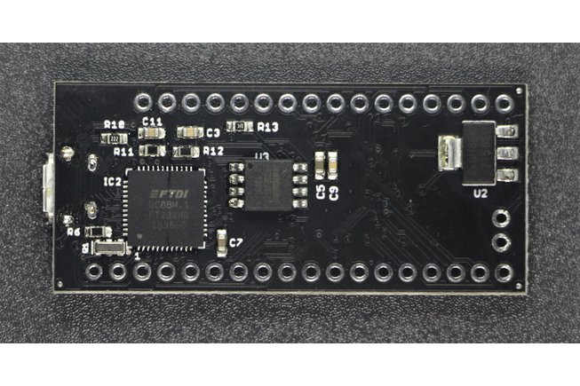

.. index::
    single: FPGA

++++++++++++++++++++++++++++++++++++++++++++++++++++++++++++++++++++++++++++++++++++++++++++++++++++
FPGA*
++++++++++++++++++++++++++++++++++++++++++++++++++++++++++++++++++++++++++++++++++++++++++++++++++++

:Auteur: J.Soranzo
:Date: Novembre 2019
:update: 29/3/2022
:Societe: VoRoBoTics
:Entity: VoLAB

.. contents::
    :backlinks: top

.. |clearer|  raw:: html

    

====================================================================================================
GENERAL
====================================================================================================

Carte low cost sur le `site Joel Williams`_

.. _`site Joel Williams` : https://joelw.id.au/FPGA/CheapFPGADevelopmentBoards

Taper fpga sur ebay !

Doulos (ressources)
----------------------------------------------------------------------------------------------------

`Doulos VHDL ressources`_

.. _`Doulos VHDL ressources` : http://doulos.com/knowhow/vhdl/

====================================================================================================
Carte low cost
====================================================================================================
Carte XILINX compatible Arduino
----------------------------------------------------------------------------------------------------
`Arduino-compatible Spartan-6 projet Hackaday`_ FPGA board sur forum Xilinx,Environ 70$

.. _`Arduino-compatible Spartan-6 projet Hackaday` : https://hackaday.io/project/38-arduino-compatible-fpga-shield

Le projet sur hackaday.io http://store.hackaday.com (lien mort 28/09/2020)

Voir projet perso 014 designed with PRotel for Windows 

`FPGA sur le site Tindie`_

.. _`FPGA sur le site Tindie` : https://www.tindie.com/search/?q=fpga

A ma dernière viste sur le site Tindie plus de carte FPGA Xilinx !

Chez AliExpress
----------------------------------------------------------------------------------------------------

Carte très simple à base de SPARTAN 

====================================================================================================
Little FPGA board
====================================================================================================
SeedStudio
----------------------------------------------------------------------------------------------------
Bonne surprise en ce mois de Mars 2022 `chez SEEEStudio`_

.. _`chez SEEEStudio` : https://www.seeedstudio.com/catalogsearch/result/?q=fpga 

- Sipeed Tang Nano FPGA Board powered by GW1N-1
- Sipeed TANG PriMER FPGA

- Spartan Edge Accelerator Board - Arduino FPGA Shield with ESP32 39.50$

Avec `son wiki rès complet chez Seeedstudio`_

.. _`son wiki rès complet chez Seeedstudio` : https://wiki.seeedstudio.com/Spartan-Edge-Accelerator-Board/

ICEBraker
----------------------------------------------------------------------------------------------------

.. index::
    pair: FPGA; Icebraker

`iCEBreaker FPGA`_ projet 2019-2020 de crowdfounding 65€

.. _`iCEBreaker FPGA` : https://www.crowdsupply.com/1bitsquared/icebreaker-fpga

Il y a un `1bit Squared store européen`_

.. _`1bit Squared store européen` : https://1bitsquared.de/products/icebreaker

Disponible sur `AMAZON Fransande Icebreaker 1.0E FPGA Lattice ICE40UP5K`_

.. _`AMAZON Fransande Icebreaker 1.0E FPGA Lattice ICE40UP5K` : https://www.amazon.fr/Fransande-Icebreaker-ICE40UP5K-D%C3%A9Veloppement-Principal/dp/B08W2ZCT8Q/ref=sr_1_40?__mk_fr_FR=%C3%85M%C3%85%C5%BD%C3%95%C3%91&crid=1LYDQ6ZJ8YGMX&keywords=fpga&qid=1648682715&sprefix=fpga%2Caps%2C98&sr=8-40

Et sur `Aliexpress Icedisjoncteur – carte de développement FPGA à treillis 1.0E, RISC-V Open`_

.. _`Aliexpress Icedisjoncteur – carte de développement FPGA à treillis 1.0E, RISC-V Open` : https://fr.aliexpress.com/item/1005001744188353.html?spm=a2g0o.productlist.0.0.2d304f57qtHUBx&algo_pvid=0af27d41-842e-4a1f-bc13-e2162b8dcee4&algo_exp_id=0af27d41-842e-4a1f-bc13-e2162b8dcee4-1&pdp_ext_f=%7B%22sku_id%22%3A%2212000017412500115%22%7D&pdp_pi=-1%3B40.61%3B-1%3B-1%40salePrice%3BEUR%3Bsearch-mainSearch

====================================================================================================
Contenu du Xmind 
====================================================================================================

::

    FPGA

            Autre carte Xilinx
                chez AliExpress 28€14
                    https://fr.aliexpress.com/item/705461772.html?recommendVersion=1
                    Xc3s500e:The xilinx spartan- 3e fpga
                    Simple 
                    A programmée en JTAG
                    Tous les I dispo sur 3 connecteurs double au pas de 2.54
                Spartan6
                    89€
                    ebay /Xilinx-FPGA-USB-Development-board Spartan-6-XC6SLX9 +Download-Cable-Programmer-/272421798098
                    Fournie avec le cable JTAG XILINX
                Spartan evec de l'ethenet
                    http://www.digitalshortcut.com/buyx50wz.html
                        119$
                        
                artix-7-fpga-development-board-for-makers-and-hobbyists/
                    ARTIX 7
                    2 options 119$ et 249$
                    Avec Ethernet
                    Exemple et doc
                        https://www.hackster.io/digilent/products/arty-s7-50
                Cora Z7 toujours chez Digilent
                    Zynq 7000
                    2 option 99$ et 129$

                    Avec Ethernet
                    exemple d'utilisation
                        www.hackster.io adam-taylor hexapod-robot-fpga-based-solution
                        https://www.hackster.io/adam-taylor
            papillo board (Xilinx premier prix ~38$)
                chez Seeedstudio complet
            Autre carte ALTERA
                23$99
                EP4CE6 Cyclone 4
                    56€
                    avec clone usb blaster
                    dernier objet
                analoglamb.com altera-max10-fpga-board-10m02scm15310m08scm153/
                    à partir de 32.99$
                    Une version aussi en LATTICE
                        MACHX02
                    Altera 10M02SCM153/10M08SCM153 Chip inside
    10M08SCM153 Chip has 8000 LEs,32K Flash,378Kb RAM
    Two SMD 7 Segment LEDs and Two RGB LEDs
    Four Buttons and Eight LEDs for Indication
    Micro USB as PSU,and Large Current LDO with 3.3V output
    Support USB Programmer
    Easy to use and mount with Two Headers
    Small Size: 20x48mm
                    Seulement 40 user io dispo
                Altera EP2C5T144
                    13.26€
                    570 LE <=> 440 macro cell
                    une centaine d'I/O
                        3x28 pin 2.54mm
                    oscillateur 50MHz
                    JTAG programmer
                        8.99
                Voir aussi Waveshare.com
            Carte Logi-Pi
                Sparten 6 LX9
                dispo chez Farnel
                    50.88€
                        pas le bon lien (carte d'extension !)
                    Attention c'est juste l'expansion board
                Chez Farnell : plus stoké

            TinyFPGA
                https://hackaday.io/project/25958-tinyfpga-a-series
                https://hackaday.io/project/26836-tinyfpga-programmer
                C'est du LATTICE avec le soft en free license
                4 carte dispo A1, A2 , B1, B2
                    de 12 à 36€
                    A1
                        18I/O
                        256 x 4 input lookup table
                Retourvé chez SPARKFUN
            Mojo
                aussi chez sparkfun
                    https://www.sparkfun.com/products/11953
                spartan6
                    environ 70$
                On la trouve également sur ebay à 39$
                tuto
                    https://alchitry.com/pages/verilog
        http://jacques.weber.pagesperso-orange.fr/
        USB blaster
            ou moins cher
        migen
            MIGEN
                ça gère la simulation (via iverilog/gtkwave)
    - ça facilite très bien l'écriture de test_bench (en python)
    - ça contient une bibliothèque de modules déjà pré-écrit (Fifo, Sdram controller, flash controller, sdram PHY, générateur d'arbitre de bus wishbone etc)
    - permet de faire du Dataflow programming
    - permet d'utiliser python au lieu de verilog ou VHDL, ça donne accès au sucre syntaxique python et à toute la puissance du paradigme objet.
    - Ca peut générer les headers .h avec les getter/setter de tes registres memory mappé si tu design un SoC (en combinant Migen à MiSoC)
    - Ca apporte une abstraction du HW (de la carte) pour faire des design portables (cf migen.git/mibuild/platforms)
    - Open source toussa
    - Ca prend donc du python et ça te sort un binaire que tu peux flasher directement dans ton FPGA (voir ça te le flash directement) EN UTILISANT LA TOOLCHAIN PROPRIO Xilinx ou Altera.

                http://fr.farnell.com/logi/logi-edu-2/add-on-board-logi-edu/dp/2466954?COM=dtss-detail_DesignCenter_ValentFX_LOGI-EDU-2%20CMPNULL
            projet open source pour écrire du fpga en python
        fpga-design-with-python : MyHDL
            créé en 2003
            http://www.myhdl.org/
        Projet IceStorm
            basé sur le projet de reverse de bitStream de Clifford Wolf 
            openSource FPGA
            Cible Lattice IceStick par exemple
            Synthèse Yosys
            IceStick Lattice
                20.89$
        Zedboard
            Zinq
            Carte Digilent
                178$
            La gamme s'est étoffée
                microzed
                picozed
                    carte support 425US$
                    à partir de 178e
                ultrazed
                ZEDboard a de l'Ethernet
                    474USD
                    Xilinx Zynq®-7000 

.. index::
    pair: FPGA; Altera

====================================================================================================
ALTERA / INTEL FPGA
====================================================================================================
MAX10 versus CYCLONE I, II, III, IV
----------------------------------------------------------------------------------------------------
LEs familles INTEL/FPGA en 2020: 

- AGILEX: 10nm intensive application
- STRATIX: high-performance, state-of-the-art products to market faster with lower risk and higher productivity.
- ARRIA: performance and power efficiency in the midrange.
- CYCLONE: meet your low-power, cost-sensitive design needs, enabling you to get to market faster.
- MAX10: revolutionize non-volatile integration by delivering advance processing capabilities in a low-cost, single chip small form.

MAX10 : CPLD techno Flash (pas tout à fait vrai - la flash est intégré au boîtier)

CYCLONE iV techno FPGA. Le dernier de la famille est Cyclone 10 introduit en 2017. IV en 2009 et 
V en 2011

MAX10 : introduite en 2014 après MAXII en 2004 et MAX V en 2010.

Il y a 7 tailles de puces : 10M02, 04, 08, 16, 25, 40, 50 caractèrisant le nombre de LE de 2K à 50K.
Contre 2 familles de C iV de 7 et 9 tailles famillles GX( EP4CE6 à 115 ) et GX ( EP4CGX15 à 150 ).

Cyclone 5 c'est 6 sous-familles  ou variants dont 3 integre directement des CORTEX -A9 !
(Optimized for transiver applications...)

Cyclone 10 : 2 familles LP et GX. LP sans doute pour low power

Source : `site INTEL FPGA family`_

.. _`site INTEL FPGA family` : https://www.intel.com/content/www/us/en/products/programmable/fpga.html

DECA-MAX-10 de chez ARROW 
----------------------------------------------------------------------------------------------------
.. image:: images/decaMax10.jpg 
   :width: 600 px

`ARROW DECA MAX-10`_ : environ 155$

10M50DAF484C6G FPGA 

50k LE, 1638 KRM, 

ARROW 

Parmis les choses intéressante de cette carte : sortie HDMI, coupleur Ethernet, lecteur de carte
micorsd,

QSys se nomme maintenant Plateform Designer  dans la chaine Quartus

Altera MAX ® 10 **10M50DAF484C6G** device
 - 50,000 LEs
 - 1,638 Kbit (Kb) M9K memory
 - 512 Kbit (Kb) user flash memory
 - Four phase locked loops (PLLs)
 - 144 18x18bit multipliers
 - Two ADC blocks – 1 MSPS, 12-bit, 9-channels each
 - 18 analog inputs
 - One on-chip temperature sensor
 - 360 general purpose input/output (GPIO)
 - Non-volatile self-configuration with dual-boot support

External peripherals

 - USB Blaster II onboard for programming; JTAG Mode
 - 512 M B DDR3 SDRAM (16 bit data bus)
 - 64 MB QSPI Flash
 - Micro SD card socket
 - Two CapSense button s
 - Two push buttons
 - Two s lide switches
 - Eight blue user LEDs
 - Three 50MHz clock sources from the clock generator
 - 24 bit CD quality audio CODEC with line in, line out jacks
 - HDMI TX, incorporates HDM v1.4 features, including 3D video supporting
 - One 10/100 Mbps Ethernet PHY with RJ45 connector
 - One USB 2.0 PHY with mini USB type AB connector
 - One MIPI connector interface supports camera module application
 - One proximity /ambient lighter sensor
 - One humidity and temperature sensor
 - One temperature sensor
 - One accelerometer
 - Two MAX 10 FPGA ADC SMA inputs
   
.. _`ARROW DECA MAX-10` : https://www.arrow.com/fr-fr/products/deca/arrow-development-tools 

BeMicro Max10 AVNET également
----------------------------------------------------------------------------------------------------

ou `BeMicro Max10`_ : environ 30$, **10M08DAF484C8GES**

8 LED, 2 BP, 8000 LE, 108kRAM, 12kFlash interne, 1 à 2 PLL, dual configuration memory

50MHz oscillator

.. _`BeMicro Max10` :  https://www.arrow.com/fr-fr/reference-designs/bemicro-max10-fpga-evaluation-kit-adopts-alteras-non-volatile-max-10-fpga-built-on-55-nm-flash-process/45cdf7d717bc14e6dfb1044001fb7c4f 

Extrait du gettnng started:

One MAX® 10 FPGA (10M08DAF484)
 - 8,000 LEs
 - 414 Kbit (Kb) on-chip memory
 - 256 Kbit (Kb) user flash memory
 - 2 phase locked loops (PLLs)
 - 24 18x18-bit multipliers
 - 1 ADC block – 1 MSPS, 12-bit, 18-channels
 - 17 analog inputs
 - 1 temperature sense diode
 - 250 general purpose input/output (GPIO)
 - Non-volatile self-configuration with dual-boot support

Embedded USB-Blaster™ for use with the Quartus® II Programmer

External peripherals
 - 8MB SDRAM (4Mb x 16) (ISSI IS42S16400)
 - Accelerometer, 3-Axis, SPI interface (Analog Devices ADXL362)
 - DAC, 12-bit, SPI interface (Analog Devices AD5681)
 - Temperature sensor, I2C interface (Analog Devices ADT7420)
 - Thermal resistor
 - Photo resistor
 
`beMicroMax10 Design Example`_ (maintenant que c'est Intel !)

.. _`beMicroMax10 Design Example` : https://fpgacloud.intel.com/devstore/platform/?board=4 

ALTERA Cyclone II EP2C5T144 CPLD FPGA Development Board 
----------------------------------------------------------------------------------------------------

`Sur ebay`_ 11.51€

`Sur Deal Extrem`_ 16.84$

`Sur amazone`_ 19.99$

Il faut un USB-Blaster, Y en a à pas cher

Offre groupée Amazone avec bookin Verilog ?en 12/2019

Carte plutôt facile à trouvé. Se pause alors le problème de l'outil Quartus

.. _`Sur ebay` :  https://www.ebay.fr/itm/ALTERA-FPGA-Cyslonell-EP2C5T144-Minimum-System-Lernen-Development-Platte/322774547075?_trkparms=aid%3D555018%26algo%3DPL.SIM%26ao%3D2%26asc%3D20160323102634%26meid%3Da93f2964d1e940c8b5ecf75fc224f7f5%26pid%3D100623%26rk%3D1%26rkt%3D6%26sd%3D321573901213%26itm%3D322774547075%26pmt%3D1%26noa%3D0%26pg%3D2047675&_trksid=p2047675.c100623.m-1

.. _`Sur Deal Extrem` : https://www.dx.com/p/altera-fpga-cycloneii-ep2c5t144-minimum-system-learning-development-board-module-blue-2027404.html#.XejsF3aJLam

.. _`Sur amazone` : https://www.amazon.com/RioRand-EP2C5T144-Altera-Cyclone-Development/dp/B00LEMKR92 

ALTERA Cyclone IV 
----------------------------------------------------------------------------------------------------
Moins de 40$

`Nouveau 2019 Altera Cyclone Iv FPGA EP4CE6E22C8N Development Board USB V2.0 CPLD`_

Le pb avec de telles cartes, dont on ne connait que peut sur les origines, est la doc !

J'ai trouvé `une vidéo sur Youtube`_ (pas super mais je la garde pour les improuvments)
et un `lien Google doc non officiel`_

.. _`Nouveau 2019 Altera Cyclone Iv FPGA EP4CE6E22C8N Development Board USB V2.0 CPLD` : https://www.ebay.fr/itm/New-2019-Altera-Cyclone-IV-FPGA-EP4CE6E22C8N-Development-Board-USB-V2-0-CPLD/163044282291?hash=item25f6324fb3:g:QlgAAOSwCGVX5KLz
 
.. _`une vidéo sur Youtube` : https://www.youtube.com/watch?v=woBspKIFK3A

.. _`lien Google doc non officiel` : https://drive.google.com/drive/folders/0B3UvX75P-bRdcXZNaWQ1dEs0R2M

Mais si on réfléchi 2 minutes le concepte de la carte plus simple juste pris en temps que coeur,
ne serait-il pas mieux ?

Comme `ce genre de carte`_ avec les broches tournées vers le bas

.. _`ce genre de carte` : https://www.waveshare.com/product/CoreEP4CE6.htm

CoreEP4CE6, ALTERA Core Board
 - EP4CE6E22C8N:the ALTERA Cyclone IV FPGA device which features:
 - Operating Frequency: 50MHz
 - Operating Voltage: 1.15V～3.465V
 - Package: QFP144
 - I/Os: 80
 - LEs: 6K
 - RAM: 270kb
 - PLLs: 2
 - Debugging/Programming: supports JTAG

Juillet 2020 sur la chaîne d'Heliox on parle de la chaine de  Électro-Bidouilleur

Parmis ses playlistes, il y en a une sur les FPGA : `Playliste FPGA sur Electro-Bidouilleur`_

.. _`Playliste FPGA sur Electro-Bidouilleur` : https://www.youtube.com/watch?v=6p0UO1i2iy4&list=PLfiqNnhpCsNsn6g_VjZ4VizI3iQJcMS27

.. image:: images/ebayCyclone4.jpg
   :width: 600 px
 
Quartus
----------------------------------------------------------------------------------------------------
Il faut lui créer un sous-dossier !

`On line course`_

.. _`On line course` :  https://www.intel.com/content/www/us/en/programmable/support/training/catalog.html?courseType=Online

====================================================================================================
LATICE / TinyFPGA
====================================================================================================

Carte low cost et toutes petites: `TinyFPGA`_

`Autre source d'information`_

`A1`_ : 256 logic cells 16.95€

`AX2`_ : 1200 LE 23.95€

MACH-XO2 

`Programmer chez Elector`_ à 15€

.. _`TinyFPGA` : https://tinyfpga.com/

.. _`Autre source d'information` : https://www.eeweb.com/profile/duane-benson-2/articles/a-look-at-tinyfpga-boards

.. _`A1` :  https://www.elektor.fr/tinyfpga-a1

.. _`AX2` :  https://www.elektor.fr/tinyfpga-ax2

.. _`Programmer chez Elector` : https://www.elektor.fr/tinyfpga-programmer

====================================================================================================
XILINX
====================================================================================================
Carte pour de la vidéo compter environ 3 à 400$

`Chez Numato Lab Opsis`_

.. _`Chez Numato Lab Opsis` : https://numato.com/product/numato-opsis-fpga-based-open-video-platform/

2 HDMI in et 2 HDMI out + 1 DPIn and  1 DPOut  c'est du lourd et open source.

Cartes DIGILENT
----------------------------------------------------------------------------------------------------
`Site officiel`_

.. _`Site officiel` : https://digilent.com/shop/boards-and-components/system-boards/

ARTIX x7 board
****************************************************************************************************
S7 : Spartan

A7 : `Artix`_

.. _`Artix` : https://digilent.com/shop/arty-a7-artix-7-fpga-development-board/

Z7 : Zynq

Partage une sressemblance pour ne pas dire un facteur de forme.

`ARTIX A7 Ref manuel`_ exclusivement en ligne ! 

.. _`ARTIX A7 Ref manuel` : https://digilent.com/reference/programmable-logic/arty-a7/reference-manual?redirect=1 

Facteur de forme intéressantant:

`Digilent CMOD A7`_

.. _`Digilent CMOD A7` : https://digilent.com/shop/cmod-a7-35t-breadboardable-artix-7-fpga-module/

Existe en `SPARTAN7 CMOD S7`_

.. _`SPARTAN7 CMOD S7` : https://digilent.com/shop/cmod-s7-breadboardable-spartan-7-fpga-module/

ZYBO Z7 pour la vidéo
----------------------------------------------------------------------------------------------------
249$ en version signle Core

HDMI in et 1 HDMI out

====================================================================================================
UPDuino
====================================================================================================
UPduino v2.1: low cost FPGA board et openSource

sur `tindie.com`_ : 19.95us$

Ce projet n'est pas très clair. Qui en est à l'origine ?

Ce serait tinyvision-ai.inc (qui n'ont qu'un pauvre github), mais on peut y lire:

The original design for the UPduino v2.0 was from `GnarlyGrey`_

Peut être programmer avec les outils du `projet icestorm`_

`Lattice ICE40 Ultra Plus 5K FPGA`_ with 5300LUT

FTDI FT232H USB programmer, 
30 GPIO on 0.1” headers,
8MB SPI Flash,
RGB LED,
PMOD compatible,
On-board 3.3V and 1.2V Regulators
Open source
Arduino nano footprint compatible

Composant : ICE40UP5K-SG48

|clearer|

.. _`tindie.com` : https://www.tindie.com/products/tinyvision_ai/upduino-v21-low-cost-fpga-board/

.. _`GnarlyGrey` : http://gnarlygrey.com/?i=1

.. _`projet icestorm` : http://www.clifford.at/icestorm/

.. _`Lattice ICE40 Ultra Plus 5K FPGA` :  https://www.latticesemi.com/en/Products/FPGAandCPLD/iCE40UltraPlus

====================================================================================================
Open source FPGA tools
====================================================================================================
Eh bien on peut dire que ça à l'air d'être un joyeux bordel !

Il y a d'abord le `projet icestorm`_

APIO
----------------------------------------------------------------------------------------------------
Puis APIO:

.. image:: images/apio.jpg
   :width: 200 px
   :alt: APIO
   :align: left

:: 

    Open source ecosystem for open FPGA boards. It was inspired by PlatformIO.

    Apio (pronounced [ˈa.pjo]) is a multiplatform toolbox, with static pre-built packages, 
    project configuration tools and easy command interface to verify, synthesize, 
    simulate and upload your verilog designs.

    Apio is used by Icestudio.

Et qui dit PlatformIo dit... Python ;-) Notez que j'ai rien contre Python mais j'ai rien pour non
plus...

ICEstudio
----------------------------------------------------------------------------------------------------
04/2022 UPDATE `site pour download icestudio`_ en bas de page v0.9.0 dl et installée pc msi

Install plantée. elle a tentée un pip install

.. _`site pour download icestudio` : https://icestudio.io/#lk-overview

Donc par dessus il y a Icestudio:

.. image:: images/icestudio.jpg
   :width: 200 px
   :alt: APIO
   :align: left

|clearer|

Et en se baladant sur le github de `icestudio`_, on découvre d'autres cartes (c'est beau la 
magie du surf)

.. _`icestudio` : https://github.com/FPGAwars/icestudio

Au final cela s'installe bien. Une bonne surprise. (Sur Windows7 en tout cas) mais cela install 
aussi Python 2.7

J'ai l'impression que cela ne supporte que le Vérilog.

.. index::
    pair: FPGA; Symbiflow

Symbiflow
----------------------------------------------------------------------------------------------------
`Site officiel Symbiflow`_

.. _`Site officiel Symbiflow` : https://symbiflow.github.io/

SymbiFlow is a fully open source toolchain for the development of FPGAs of multiple vendors.
Currently, it targets the Xilinx 7-Series, Lattice iCE40, Lattice ECP5 FPGAs, QuickLogic EOS S3
and is gradually being expanded to provide a comprehensive end-to-end FPGA synthesis flow.

Simulateur open source
----------------------------------------------------------------------------------------------------

ghdl Tristan Ginglod

http://ghdl.free.fr/

====================================================================================================
Weblinks
====================================================================================================

.. target-notes::
