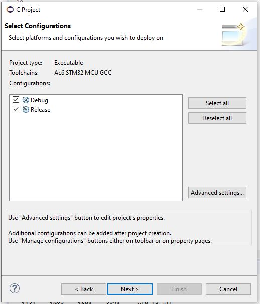

.. index::
    single: NUCLEO; Board
    
++++++++++++++++++++++++++++++++++++++++++++++++++++++++++++++++++++++++++++++++++++++++++++++++++++
NUCLEO board *
++++++++++++++++++++++++++++++++++++++++++++++++++++++++++++++++++++++++++++++++++++++++++++++++++++

:Auteur: J.Soranzo
:Date: Mars 2020
:Societe: VoRoBoTics
:Entity: VoLAB

.. contents::
    :backlinks: top

.. _refNucleoBoard:

====================================================================================================
Présentation
====================================================================================================
3 type de cartes 32, 64, 144 : fonction de la taille du boîtier du composant utiliés!

LQFP64 package, LQFP144 package

`STM32MCU wiki`_

`NUCLEO-overview`_

`NUCLEO-144_MOUSER`_

RCC acronym : Reset and Control Clcok

Carte NUCLEO-F401RE 
====================================================================================================
Chip: STM32F401RE (R = 64pin package, E = 512k FLASH)

.. image:: images/F401xE_features.jpg
   :width: 500 px

Carte NUCLEO64

Prix indicatif : 13€ `NUCLEO-F401RE chez MOUSER`_

**Osc clock supply**
See in UM1724 STM32 Nucleo-64 boards (MB1136) §6.7

**Ressources pour le dev**
Ok il y a CubeMX qui mâche bien le boulot.

Ok il y a les pdf, mais il n'y en a pas de spécifique à cette carte en particulier.

On a:

- La doc du processeur : la datasheet ne contient pas les registres des périph (135 pages)

- PM0214 : programming manuel 245 pages : mais bon sans plus, à relire un de ces prochains jours.

- RM0368 : Reference manuel 835 pages

- UM NUCLEO board 64 : UM1724 : forunit quelques précieuse informations parfois.

Mais on peut aussi s'aider de la doc dcoxygen généré (cf. Modules/STM32F4xx_HAL_Driver)

Mais quand tout ça ne suffit pas :

Exemple la fonction : HAL_GPIO_Init accepte un premier paramètre de type : GPIO_TypeDef qui n'est
pas tellement documenté.

Tips: l'IDE fournit un moyen rapide d'accéder à sa déclaration et on apprend ainsi qu'elle se trouve
dans le fichier::

    /CMSIS/Device/ST/STM32F4xx/Include/stm32f401xe.h

Carte NUCLEO-F429ZI
====================================================================================================
Chip: STM32F429ZI (Z = 144pin package, I = 2048k FLASH)

32b Arm® Cortex®-M4 MCU+FPU, 225DMIPS, up to 2MB Flash/256+4KB RAM, USB
OTG HS/FS, Ethernet, 17 TIMs, 3 ADCs, 20 com. interfaces, camera & LCD-TFT

.. image:: images/F429_features.jpg
   :width: 500 px

Carte NUCLE144

Prix indicatif : 26€ `NUCLEO-F429ZI chez MOUSER`_

 
.. _`NUCLEO-overview` : https://www.st.com/en/evaluation-tools/stm32-nucleo-boards.html#overview

.. _`NUCLEO-144_MOUSER` : https://www.mouser.fr/new/stmicroelectronics/stm-stm32-nucleo-144-dev-boards/

.. _`STM32MCU wiki` :  https://wiki.st.com/stm32mcu/wiki/Main_Page

.. _`NUCLEO-F429ZI chez MOUSER` : https://www.mouser.fr/ProductDetail/STMicroelectronics/NUCLEO-F429ZI?qs=mKNKSX85ZJcE6FU0UkiXTA==&vip=1&gclid=CjwKCAjwguzzBRBiEiwAgU0FT1UiJxq6z6simiBPlGAwmrXBhkqT_WmzdohmaAP8F2i-SyZEE2RqPRoConUQAvD_BwE

.. _`NUCLEO-F401RE chez MOUSER` : https://www.mouser.fr/ProductDetail/STMicroelectronics/NUCLEO-F401RE?qs=sGAEpiMZZMu3sxpa5v1qrjJpfJ%2F%252BCrSiyHUXpPlRNo4%3D

====================================================================================================
Outils de développement
====================================================================================================
STM32CubeMX est l'outil indispensable et **IL FAUT COMMENCER par LUI** voir `UM1718_CubeMX.pdf`_
J'utilise actuellement (04/2020) la version 5.6.0

STM32 workbench développé par ACSYSY ou AC6. Dans la litérature ST cette suite logiciel se nome
SW4STM32. Il en est question sur la `page officiielle SW4STM32`_ qui renvoie vers
`la page openstm32`_

Cet outil est basé sur Eclipse. Je ne suis pas fan. Je trouve que tout cela est très lourd ! Mais 
comme ces petits microcontroleurs ont l'air plein de potentiel, je fais l'effort... 

System Worbench for STM32 : vers qui faut-il se trouner pour avoir de l'aide ?

Eclipse, Acsys ou ST ? ou peut-ête vers `le site openstm32.org`_ (ce qui reviens à peut près 
au même que AC6)

Exemple la commande Format du menu Source ! On fini par la trouver dans l'aide de Eclipse::

    C/C++ Development User Guide/Reference/C/C++ Menubar/Source Menu

.. _`page officiielle SW4STM32` : https://www.st.com/en/development-tools/sw4stm32.html

.. _`la page openstm32` : https://www.openstm32.org/HomePage

.. _`le site openstm32.org` : https://www.openstm32.org/HomePage

Autres outils de développement 
====================================================================================================
Officiellement sur le `site ST outils de dev`_, il y a :

.. image:: images/outilsDev.jpg
   :width: 600 px

La page product selector annonce 32 items au 10/04/2020, la plupart sont payant comme IAR, KEIL

Atolic TrueStudio => remplacé par `STM32cubeIDE`_

Au niveau des fonctionnalité cela ressemble à STM32workbench si ce n'est que ST annonce une forte 
intégration avec STM32cubeMX.

KEIL uVision

Qt possible également : il faudra que j'explore cela !

.. _`STM32cubeIDE` : https://www.st.com/en/development-tools/stm32cubeide.html

.. _`site ST outils de dev` : https://www.st.com/en/development-tools/stm32-ides.html

====================================================================================================
Les pdf étudiés
====================================================================================================
Il y en a des tas !!! Il y a même des fichiers .chm dans les packages. Exemples::

    STM32Cube_FW_F4_V1.25.0\Drivers\BSP\STM32F4xx-Nucleo
    STM32Cube_FW_F4_V1.25.0\Drivers\STM32F4xx_HAL_Driver et là pas de bol il n'y a rien pour 
    NUCLEO-F401 snif

gettingStarted_firmware_en.DM00105925.pdf
====================================================================================================
Getting started with the STM32 Nucleo board firmware package UM1726

16 pages DocID025839 Rev 2 de avil **2014**

This document describes the software, firmware environment and development
recommendations required to build an application around the STM32 Nucleo board
(NUCLEO-F103RB, NUCLEO-L152RE, NUCLEO-F030R8 and NUCLEO-F302R8) with
some demonstration firmware (STSW-STM32143).

Remarque : SSTSW-STM32143 : TM32 Nucleo examples, based on Standard Peripheral Library (UM1726)

Ce document parle du firmware package::

    The STM32 Nucleo board firmware drivers and examples are based on the Standard
    Peripheral library, and are provided in one single package supplied in a zip file. The
    extraction of the zip file generates one folder, STM32_Nucleo_FW_VX.Y.Z
    
Et pas en.stm32cubef4_v1-25-0.zip ? Je n'ai pas trouvé d'autre zip sur le site ! Ce genre de petites
 incohérences rendent les choses encore plus compliquées qu'elles ne sont.
 
J'ai décompacté la version cube que j'ai du zip dans dossier 1 et l'arborescence ne correspond pas
complètement à ce qui est décrit dans le document ! Or, on trouve dans l'arbo en question un 
document d'explication plus récent que celui-ci : UM1730 de février 2019

   
Adresse de cette copie d'écran : page `nucleo-F401RE Tools and Softwares`_

.. _`nucleo-F401RE Tools and Softwares` : https://www.st.com/content/st_com/en/products/evaluation-tools/product-evaluation-tools/mcu-mpu-eval-tools/stm32-mcu-mpu-eval-tools/stm32-nucleo-boards/nucleo-f401re.html#tools-software

J'abandonne donc l'étude du présent document pour me consacré à ce document plus récent.

STM32CubeF4GettingStarted.pdf 
====================================================================================================
**Getting started with STM32CubeF4 MCU Package for STM32F4 Series** UM1730 février 2019 28 pages

manip du 22/03/2020 : tentative d'ouvir l'exemple GPIO toggle

Workspace::
 
    ...\STM32Cube_FW_F4_V1.25.0\Projects\STM32F401RE-Nucleo 

Quand on change d'espace de travail, l'application redémarre entièrement et est très longue à
redémarrer !

Quand on importe le projet, il se nomme STM32F4xx-Nucleo et pas GPIO ! et tous les exemples risquent
 de se nommer ainsi. Il y a un post sur le forum : `Rename projects ..Does that work ?`_
 
**Essai 1** : import avec copy to workspace: 6 warning invalid projet path (des chemin relatifs)::

    Description	Resource	Path	Location	Type
    Invalid project path: Include path not found (C:\MountWD\00-Outils\06-ConceptionDeveloppement\ST\STM32Cube_FW_F4_V1.25.0\Projects\Inc).	STM32F4xx-Nucleo		pathentry	Path Entry Problem
    Invalid project path: Include path not found (C:\MountWD\00-Outils\06-ConceptionDeveloppement\ST\STM32Cube_FW_F4_V1.25.0\Projects\STM32F401RE-Nucleo\STM32F4xx-Nucleo\Debug).	STM32F4xx-Nucleo		pathentry	Path Entry Problem
    Invalid project path: Include path not found (C:\MountWD\Drivers\BSP\STM32F4xx-Nucleo).	STM32F4xx-Nucleo		pathentry	Path Entry Problem
    Invalid project path: Include path not found (C:\MountWD\Drivers\CMSIS\Device\ST\STM32F4xx\Include).	STM32F4xx-Nucleo		pathentry	Path Entry Problem
    Invalid project path: Include path not found (C:\MountWD\Drivers\CMSIS\Include).	STM32F4xx-Nucleo		pathentry	Path Entry Problem
    Invalid project path: Include path not found (C:\MountWD\Drivers\STM32F4xx_HAL_Driver\Inc).	STM32F4xx-Nucleo		pathentry	Path Entry Problem

Evidement cela ne compile pas : no rule to make.

**Essai 2** : sans copy : toujours un warning et toujours pas de possibilité de build sans créer une 
nouevelle target comme pour l'essai 1. Je n'ai même pas essayé de compiler

**Essai 3** : le workspace directement au niveau de l'exemple et au plus près::

    ...\STM32F401RE-Nucleo\Examples\GPIO\GPIO_IOToggle\SW4STM32

Cette configuration fonctionne au moins.

.. _`Rename projects ..Does that work ?` : https://www.openstm32.org/forumthread774

Dans le document, on apprend que le package contient:

- STM32Cube :term:`HAL` STM32 abstraction layer embedded software maximizing portability across the STM32 portfolio
- low-layer APIs (LL) for a set of peripherals, offering a fast, lightweight, expert-oriented layer that is closer to the hardware than the HAL
- a consistent set of middleware components, such as RTOS, USB, TCP/IP and graphics
- all embedded software utilities, with a full set of examples

Pour information : :term:`BSP` Board Support Package

Au chapitre 3, §3.1, il est écrit:  "The user only has to define the right macro in stm32f4xx.h"
Or dans les exemples fournis, on ne trouve ni trace de cette macro ni même de ce fichier !
La confusion, la confusion... Je ne l'ai trouvé dans les fichiers : `CMSIS`_

**Etude du §4.2 How to develop an application**

4.2.1 HAL app. Une note très importante

.. warning::
    If an existing project is copied into another location, the include path must be updated.
    
Sauf qu'on ne nous dit pas comment !

En résumé::

    1. Create a project
    2. Add the necessary middleware to the project (optional)
    3. Configure the firmware components
    4. Start the HAL Library
    5. Configure the system clock
    6. Peripheral initialization
    7. Develop an application process
    
Avec l'expérience, je dirais qu'en ce qui concerne STM32Workbench, il est nettement préférable 
de laisser faire le wizard. Et même là c'est gagné! Voit `STM32Workbench minimum project`_

   
UM1718_CubeMX.pdf
====================================================================================================
STM32CubeMX for STM32 configuration and initialization C code generation 

UM1718 User manual 363 pages rev 31 12/2019.

C'est la doc de CubeMX : a graphical software configuration tool that allows to generate C 
initialization C code using graphical wizards.

En revenche, il y est question de 
HAL driver user manuals for STM32F4xx (UM1725)

Il semble que cela soit un outil **indispensable** pour démarrer un nouveau projet. 

Vidéo `Youtube pour Stm32CubeMX`_

.. WARNING::
    Voir le menu help/doc and ressources (il y a encore plein de pdf..)

.. _`Youtube pour Stm32CubeMX` : https://www.youtube.com/watch?v=szMGedsp9jc

Initilize all periperals in their default mode ? Mais quel est-il, je n'ai encore rien pu trouvé
à ce sujet. En fait, page 62/363, on trouve::

    Selecting a board and accepting to initialize all peripherals to their default mode 
    automatically sets both the pinout and the default modes for the peripherals available 
    on the board. This means that STM32CubeMX generates the C initialization code for all the 
    peripherals available on the board and not only for those relevant to the user application
    
J'en déduit qu'il vaut mieux répondre non. Mais cubeMX configure quand même tout ce qui est horloge
et reset.

L'HELP de cubeMX renvoi vers le présent document.

getting-started-with-stm32-nucleo-board-software-development-tools-stmicroelectronics.pdf
====================================================================================================
dm00105928- UM1727 22 pages de Janvier 2016

Getting started with STM32 Nucleo board softwaredevelopment tools, **UM1730** semble plus à jour.

Petite description des différentes chaînes de dev

**N'apporte rien !**

====================================================================================================
Mes manips de 2015
====================================================================================================
Décembre 2015, journal de manip en version OpenOffice, aidé du `livre de Carmine Noviello`_

.. _`livre de Carmine Noviello` :  http://leanpub.com/mastering-stm32

Dans son livre Carmine porpose d'installer un chaine de développement basée sur Eclipse et GCC
et s'en explique...

Installation des outils::

    Install dans c:\STM32Toolchaine comme décrit dans le livre pour ne pas être emmerdé 
    dans un premier temps.
    Dézippe versin 64bits => une ereur à propos des plug in
    dl java mais passage de la page it à fr.
    Premier lancement d'Eclipse => error java
    installjava => toujours la même erreur.
    Recommencer avec version 32 bits, ça marche.
    Install ECLIPSE + Plugin : OK
    Install GCC-arm avec le conseil sur le PATH suivi.
    Install Build Tools :
    Dl version 32 bits
    Installation sans problème
    openocd : pas d'install, juste un unzip et un rennommage
    ST Tools
    STM32CubeMX => ok
    ST-LINK Utility => ok
    Install Nucleo drivers: dl sous forme de zip, renommage du fichier en NucleoDriver.zip
    Upgrade ST-LINK firmware OK
    Temps pour installer tout ça 3 heures
    Next stage hello word
    
    à suivre...

Manip micro Python cf journal au 25/12/2015 (à récupérer pour mettre ici)

Et `STM32duino`_ ?

.. _`STM32duino` : https://github.com/stm32duino/wiki/wiki/Getting-Started

----------------------------------------------------------------------------------------------------

.. index::
    single: NUCLEO; STM32Workbench minimum

====================================================================================================
STM32Workbench minimum project
====================================================================================================

SW4STM32

.. NOTE::

    File-->New-->Project...
    
    In the "New Project" dialog box : select C/C++ --> C Project and click Next

    In the "C Project" dialog : in project type select "AC6 STM32 MCU Project" under Toolchains
    Select "AC6 STM32 MCU GCC" and give a project name the click Next
    
    In the "Select Configurations" dialog just click Next
    
    In the "Target configurations" dialog select the right board (NUCLE-F401RE for me)
    and click Next and **not** Finish
    
    In the "Project Firmware configuration" dialog: select Hardware Abstraction Layer and 
    if you need them "Add low level driver in your project" and **Finish**
    
La dernière option est nécessaire si on veut une structure minimum pour commencer.

Il vaut mieux laisser le C/C++ indexer en bas à doite terminer sa tâche.
    
.. image:: images/stm32wkp_newProject.jpg
   :width: 100 px

.. image:: images/stm32wkp_newProjectDialog.jpg
   :width: 100 px

.. image:: images/stm32wkp_newProjectToolChaine.jpg
   :width: 100 px

.. image:: images/stm32wkp_newProjectTargetConf.jpg
   :width: 100 px

.. image:: images/stm32wkp_newProjectFirmwareConfig.jpg
   :width: 100 px

.. WARNING::
    Lorsque tout est terminé, faire un essai de compilation.

Ensuite si tout va bien, on peut commencer à coder. Comme décrit dans la documentation (
UM1730 §4.2), il faut commencer par initialiser HAL et l'horloge.

Donc dans la fonction main():

.. code:: cpp

    HAL_Init();
    SystemClock_Config();
    
La première de ces 2 fonctions est définie dans le package dans le fichier stm32f4xx_hal.c

La deuxième doit être définie localement. Tous les exemples présent contiennent cette fonction donc
copier/coller . Il faut prnedre avec la fonction static void Error_Handler(void) pour que cela 
compile.

    

====================================================================================================
Autres drivers et outils
====================================================================================================
Lors de la création d'un projet dans la dernière boîte de dialogue, Project Firmware configuration,
il y a 2 zones particulière avec des cases à cocher:
- Additionnal drives
- Additionnal utilities and Third-party Utilities

On trouve la doc de ces modules dans leur répertoire respectifs sous Middleware.

- STemWin
- STM32_Audio
- STM32_USB_Device_Library
- STM32_USB_Host_Library
- TouchGFX

----------------------------------------------------------------------------------------------------

.. index::
    single: NUCLEO; CMSIS

====================================================================================================
CMSIS
====================================================================================================
`Page officielle CMSIS`_

Ce que c'est::

    The CMSIS is a vendor-independent hardware abstraction layer for microcontrollers that are 
    based on Arm® Cortex® processors. The CMSIS defines generic tool interfaces and enables 
    consistent device support. It provides simple software interfaces to the processor and 
    the peripherals, simplifying software re-use, reducing the learning curve for microcontroller 
    developers, and reducing the time to market for new devices.

.. _`Page officielle CMSIS` :  https://arm-software.github.io/CMSIS_5/General/html/index.html

====================================================================================================
FreeRTOS sur NUCLEO
====================================================================================================

Voir dans: :ref:`FreeRTOS on STM32 NUCLEO<refFreeRtosStm32>`

====================================================================================================
Tips
====================================================================================================
**ctrl+space** dans l'editeur de STM32Workbench pour le code complétion

Doxygen support
====================================================================================================
Visiblement c'est pas la préocupation principal.
On peut activer le support de doxygen dans Preference/Editor Documentation Tolls Comment
(liste déroulante)

Sur les forum on trouve une référence à /** suivit de return qui produirait automatiqument un bloc
de commentaire pour une fonction. Je n'ai jamais réussi à le faire fonctionné.

Je me suis créé des template qui commencent tous par doxy comme cela dans l'éditeur je tape doxy
 suivit de ctrl+SPACE et j'ai ma liste de template.

NULCEO-F401 doesn't start in stand alone mode
====================================================================================================
I have a board with ST-LINK v2.J23 firmware and board doesn't start in stan alone mode 
(ie not connect to a computer) powered by a battery pack for example.

I triy a lots of internet search, a lots of test and nothing work.

I update de ST-LINK firmware to v2.J34 and it's work.

How to :
install STM32 ST Link utility and use ST-LINK/Firmware update.

.. image:: images/stlinkUtility.jpg
   :width: 500 px
   
It open a STLink upgrade dialog

.. image:: images/stLinkUpgrade.jpg
   :width: 300 px 

NOP
====================================================================================================
Afin de pouvoir placer un point d'arrêt dans une fonction vide il existe la macro __NOP()

UART console in IDE
====================================================================================================
In System Workbench : `voir sur EEBLOG`_

`Sur openstm32.org`_

En résumé:

#. Créer une nouvelle connexion serial port : Windows/Show view/Others/connections...
#. Clic droit sur la nouvelle connexion : "Open Command Shell" ouvre la fenêtre dans la console
#. Créer une nouvelle console
#. la décaller
#. la pincée

Quand une console est pincée, elle arrête de switchée uatomatiquement entre les différentes console
possibles.

.. _`voir sur EEBLOG` :  http://eeblog.co.uk/2018/11/28/serial-terminal-window-in-system-workbench/

.. _`Sur openstm32.org` : https://www.openstm32.org/forumthread5463

====================================================================================================
Weblinks
====================================================================================================

.. target-notes::

