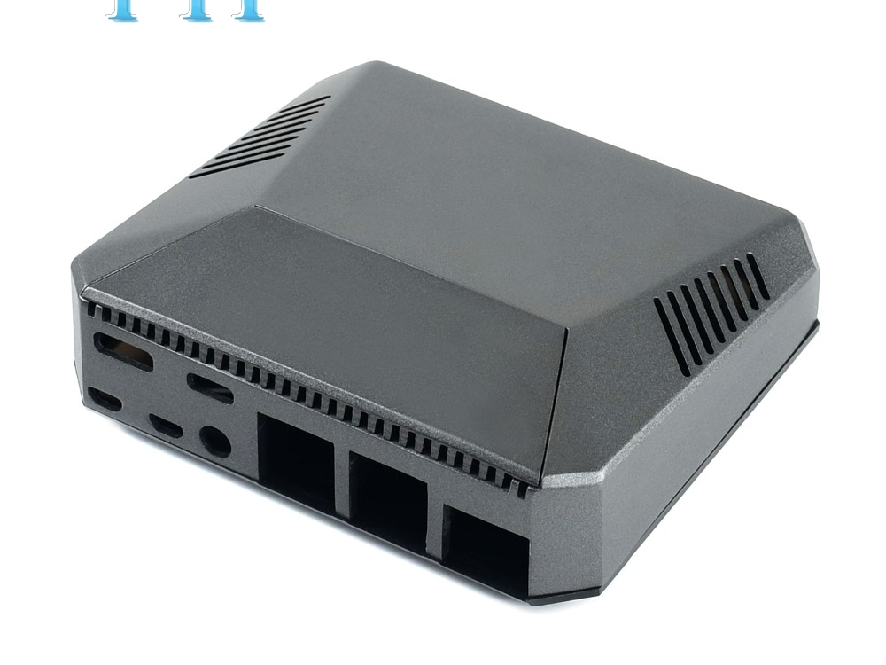

.. index::
    single: Raspberry

++++++++++++++++++++++++++++++++
Raspberry pi*
++++++++++++++++++++++++++++++++

:Auteur: J.Soranzo
:Date: Janvier 2020
:Societe: VoRoBoTics
:Entity: VoLAB

.. contents::
    :backlinks: top

====================================================================================================
Différentes cartes
====================================================================================================
Très bon comparatif sur `socialcompare.com`_

.. _`socialcompare.com` : https://socialcompare.com/fr/comparison/raspberrypi-models-comparison

====================================================================================================
Processeurs
====================================================================================================
- RPi3 model B  BCM2837 à 1.2MHz cortex A53
- RPI3 model B+ BCM2837 à 1.4MHz
- Rpi4 : BCM2711 4 coeurs CORTEX A72 version 2Go, 4Go, 8Go

Tous les modèles ci-dessus ont le même facteur de forme. Seuls le RPi 1 A+ et le RPi3 A+ ont 
un facteur de forme différent

Description complète sur `Wikipédia Raspberry pi`_

.. _`Wikipédia Raspberry pi` : https://en.wikipedia.org/wiki/Raspberry_Pi

A titre de comparaison la carte Friendly arm NEO-PC T4 RK3399 2 A72 4 A53 : ARMV8-A (un peu plus 
de 110€ sur aliexpress au 7/4/2021)

====================================================================================================
Les caméras
====================================================================================================
Greens
====================================================================================================
- V1 : OmniVision OV5647 5 Mp
- v2 : Sony IMX219, 8 Megapixels
- HQ : Sony IMXZ477 12.3 Megapixels

Black
====================================================================================================
V2: Sans le filtre infrarouge !

================================
Boîtiers
================================

Boîtier vraiment spécial `Argon ONE Raspberry`_

Disponible `aussi sur Aliexpress`_

.. _`Argon ONE Raspberry` : https://www.amazon.com/gp/product/B07WP8WC3V/ref=as_li_qf_asin_il_tl?ie=UTF8&tag=andreassspies-20&creative=9325&linkCode=as2&creativeASIN=B07WP8WC3V&linkId=5f33cb45ff5d861b244b7646a9304c6e

.. _`aussi sur Aliexpress` : https://fr.aliexpress.com/item/4000379064637.html?spm=a2g0o.productlist.0.0.7c9b14aeJTUktf&algo_pvid=3db7baeb-ea60-4b8d-8aa5-877a2ea400e2&algo_expid=3db7baeb-ea60-4b8d-8aa5-877a2ea400e2-9&btsid=b5a432b2-6dcd-44d1-9553-6b95a39eda98&ws_ab_test=searchweb0_0,searchweb201602_3,searchweb201603_53

Autres boîtier avec écrou photo 
====================================================================================================

`LABISTS Raspberry Pi 4 Boitier`_

.. _`LABISTS Raspberry Pi 4 Boitier` : https://www.amazon.fr/LABISTS-Alimentation-Interrupteur-Ventilateur-Dissipateurs/dp/B082XYTTZX/ref=asc_df_B082XYTTZX/?tag=googshopfr-21&linkCode=df0&hvadid=411537567752&hvpos=&hvnetw=g&hvrand=769575774449413025&hvpone=&hvptwo=&hvqmt=&hvdev=c&hvdvcmdl=&hvlocint=&hvlocphy=9056230&hvtargid=pla-873617557431&psc=1&tag=&ref=&adgrpid=89565690397&hvpone=&hvptwo=&hvadid=411537567752&hvpos=&hvnetw=g&hvrand=769575774449413025&hvqmt=&hvdev=c&hvdvcmdl=&hvlocint=&hvlocphy=9056230&hvtargid=pla-873617557431

Avec alim 5V/3A, cable HDMI, hublo pour caméra, ventilateur et dissipateurs...

17€ sur AMZON

================================
Disque dur sympa
================================
`SSD de petite taille sur Aliexpress`_

.. _`SSD de petite taille sur Aliexpress` : https://fr.aliexpress.com/item/32848432283.html

.. index::
    single: Raspberry; SSD HDD boot

====================================================================================================
Comment booter sur SSD
====================================================================================================

`Vidéo du gaz avec l'accent Suisse`_

.. _`Vidéo du gaz avec l'accent Suisse` : https://www.youtube.com/watch?v=gp6XW-fGVjo

`Puis le site de James A. Chambers`_ Legandary Technology Blog moi j'ai eu des pb de certificats 
pour visiter ce site

.. _`Puis le site de James A. Chambers` : https://jamesachambers.com

----------------------------------------------------------------------------------------------------

.. index::
    pair: Raspberry; install ext hdd

================================
Boot from external HDD
================================

`Un tuto qui m'a l'air facile`_

.. _`Un tuto qui m'a l'air facile` : https://www.maketecheasier.com/boot-up-raspberry-pi-3-external-hard-disk/

.. index::
    pair: Raspberry; Shutwodn

====================================================================================================
Rappel éteindre
====================================================================================================
En sudo évidement:

- shutdown -h now (en sudo)
- poweroff

=========
Weblinks
=========

.. target-notes::
