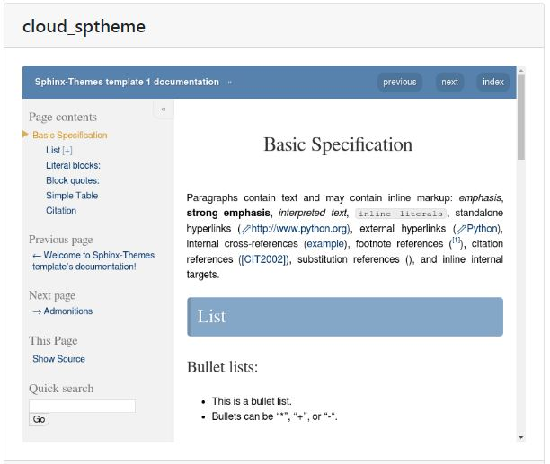

++++++++++++++++++++++++++++++++
Sphinx*
++++++++++++++++++++++++++++++++

:Auteur: J.Soranzo
:Date: Octobre 2019
:Societe: VoRoBoTics
:Entity: VoLAB

.. contents::

.. |clearer|  raw:: html

    

.. index::
    pair: Sphinx; Documentation
    

======================================
Sphinx pour la documentation
======================================

|clearer|

Voici mon utilisation de Sphinx !

Pourquoi ?
======================================
J'ai longtemps cherché un bon outil de documentation.

Quels sont mes critéres ?

A compléter.

    
.. index::
    pair: Doc-O-Matic; Documentation
    
Doc-O-Matic
======================================
Je le met ici mais je créerai un article plus tard quand j'aurai regardé de plus près

Oui mais non parce que c'est payant ! Même la version de base.

`site Doc-O-Matic`_

.. _`site Doc-O-Matic` : https://www.doc-o-matic.com/en/index.html

================================
Doc officielle
================================
`Site officiel Sphinx`_

.. _`Site officiel Sphinx` : https://www.sphinx-doc.org/en/master/index.html

`Memo rst  Sphinx readthedoc`_

.. _`Memo rst  Sphinx readthedoc` : https://rest-sphinx-memo.readthedocs.io/en/latest/ReST.html

====================================================================================================
Autres docs
====================================================================================================
`Cheat sheet sur openalea.gforge.inria.fr`_

.. _`Cheat sheet sur openalea.gforge.inria.fr` : http://openalea.gforge.inria.fr/doc/openalea/doc/_build/html/source/sphinx/rest_syntax.html#figure-directive

================================
Au VoLAB
================================

Méthode Pierre: `voir sur son journal de manip`_

.. _`voir sur son journal de manip` : https://poltergeist42.github.io/JDM/DocUtils_RST_Sphinx.html

Que je complèterais par:

#. Créer le répertoire du projet
#. Créer à l'intérieur un répertoire 'projet' et un autre 'webdoc'
#. Dans projet créer \_01-userDoc se placer dedans pour lancer sphinx-quickstart
#. Selon qu'on est sous Linux ou sous Windwos on peut effacer un des 2 make (make.bat pour Windwos)

De même que dans son chapitre Installer ``Préparation de l’arborescence``, il faut se déplacer dans
projet et faire un ``git init``

.. NOTE::
    sphinx-quickstart crée automatiquement le répertoire source

Commencer le boulot après.

Retouches de conf.py:

::
   
    master_doc = 'index'
    
    exclude_patterns = ['_build', 'Thumbs.db', '.DS_Store']
    
    html_theme = 'nature'

    html_theme_options = {
        "body_max_width" : "70%"
    }

Retouches de index.rst

::

    Si toctree il y a (ou doit y avoir):
    .. toctree::
       :maxdepth: 2
       :caption: Articles:
       :titlesonly:
    
    Supprimer : * :ref:`modindex` (on fait pas du Python ;-)

.. index::
    single: Sphinx; liens locaux
    single: Sphinx; download

================================
css pas dans gh-pages
================================
Mettre de le fichier .nojekill dans le répertoire source et pas dans le répertoire html ;-)

Ce fichier est utilisé par make html

.. index::
    single: Sphinx; Liens

Autre soucis après un crash disque ne pas faire un ``git clone le_lien_github`` mais faire
``git clone le_liengithub .`` le point est très important.

.. index::
    pair: Sphinx; csv intégration

====================================================================================================
Integre un fichier csv
====================================================================================================
::

    .. csv-table:: Legende
    :file: fichier.csv
    :header-rows: 1

make file automatique `voir site webdevdesigner.com`_ excel to csv n ligne de commande

.. _`voir site webdevdesigner.com` : https://webdevdesigner.com/q/convert-xls-to-csv-on-command-line-21100/

================================
Les liens
================================

Liens externes locaux (fichier word, pdf...)
====================================================================================================

Exemple vers un fichier pdf stocké dans la même arborescence. Externe en ce sens que ce ne sont
pas des fichier rst

On peut utiliser le role :download:

`Page Sphinx sur download`_

.. _`Page Sphinx sur download` : http://www.sphinx-doc.org/en/master/usage/restructuredtext/roles.html#role-download

Exemple :download:`doc pdf sphinx<sphinx.pdf>`

Autre :download:`utilisation avec un word <exemple_roleDL.docx>`

.. _`sur only` : https://www.sphinx-doc.org/en/master/usage/restructuredtext/directives.html#directive-only

Liens internes locaux (lien vers fichier rst)
====================================================
Lien simple dans le même fichier vers une section nommé du fichier
`css pas dans gh-pages`_

.. code::

    `nom_de_la_section`_
    

**Liens vers un fichier** .rst de la même arbo directive :ref:
**Lien vers un point en particulier dans un fichier** de l'arbo directive :ref:

.. code::

    .. _ref_lien:

    usage : :ref:`ref-lien`
    ou :ref:`nom_a_afficher<rel_lien>`

    Attention le _ dans la définition est obligatoire mais pas dans l'utilisation
    Astuce : si la définition précède un titre pas besoin de nom_a_afficher

Voir  `aide officielle ref`_

.. _`aide officielle ref` : https://www.sphinx-doc.org/en/master/usage/restructuredtext/roles.html#ref-role

Lien externe distant (url internet)
====================================================================================================
exemple url externe au système documentaire:

.. code::

    `link_desc`_
    
    .. _`link_desc` : url

================================
Themes
================================
Recherche d'un thème avec barre de navigation fixe

.. note::

	Ce serait l'option stickysidebar  bar https://www.sphinx-doc.org/en/master/usage/theming.html
	au moins pour le theme classic
    
Le pb est que les options ne sont pas commune d'un thème à l'autre.

La `page des themes Sphinx`_

.. _`page des themes Sphinx` : https://sphinx-themes.org/

testés 
======================================
**PSphinxTheme**

.. WARNING::
    Dans les premier ! Avec sidebar rétractable 5 colorations fournies. 
    Theme difficile à installer sous Windows !!! Erreur dans setup.py (os supported arch Linux ! )

**guzzle**

Ne support pas body_max_width dommage

.. image:: images/guzzle.jpg
   :width: 300 px
   :align: center

**cloud**

Plutôt pas mal, beaucoup d'option mais je trouve l'écartement entre les lignes de mon header

:Auteur: J.Soranzo
:Date: Octobre 2019
:Societe: VoLAB
:Entity: VoRoBoTics

trop important ! Même en passant bodylineheight de 1.5 à 1em directement dans le fichier de 
configuration du theme::
    
    Python38-32\Lib\site-packages\cloud_sptheme\themes\cloud\theme.conf

Installaton par pip install du fichier wheels fourni sur le site.

Theme possédant un site très complet. Existe en greencloud, redcloud mais solarcloud, magenta_cloud
ne fonctionnent pas pourtant les 2 fichiers se ressemblent beaucoup

Permet de régler la largeur avec :

.. code:: 

    html_theme_options = {
        'max_width' : '70%'
    }

Pour mettre la même couleur entre le fond et les bordures: ``'borderless_decor' : 'true'``

La config du theme est dans: 

.. code:: 

    C:\Program Files\Python37\Lib\site-packages\cloud_sptheme\themes\cloud\theme.conf

**murray**

Trop blanc mais intéressant pour son menu repliable.

**Astropy**

S'install avec un fichier wheel. pip install astropy_sphinx_theme-1.1-py2.py3-none-any.whl
Source sur github

Nécessite quelque retouche dans la barre mais mériterait de regénérer un wheel modifié pour le logo

.. code::

	...\Python\Python38-32\Lib\site-packages\astropy_sphinx_theme\bootstrap-astropy\static

astropy_logo_32.png

et dans layout.html changer le lien vers une autre destination

A partir de la ligne 530 du css, il y a la largeur du doc

.. code::

	div.body {
		background-color: #ffffff;
		padding: 0 0 0px 20px;
		min-width: 450px;
		max-width: 2000px;	
	}

	div.bodywrapper {
		margin: 0 0 0 230px;
		max-width: 80em;
	}

A tester 
======================================
- catalystcloud
- rtd Read The Doc https://sphinx-rtd-theme.readthedocs.io/en/stable/installing.html
- Bizstyle ou  similaire allanc-sphinx : grégoire

Rejetés
====================================================================================================
- agoraplex.themes.sphinx : aucune des fonctionnalités recherchées

====================================================================================================
Sphinx to pdf
====================================================================================================
make latexpdf

mais il faut installer basic-miktex-2.9.7216-x64.exe et perl.exe

Essais du 17/06/2020: problème d'encodage pour latex. Installation de nombreuses dépendances latex
en automatique

====================================================================================================
Petits trucs
====================================================================================================

.. index::
    single: Sphinx; Doxylink

Liens Doxygen
====================================================================================================
doxylink : contributed extension

`Doxylink documentation`_

.. _`Doxylink documentation` : https://sphinxcontrib-doxylink.readthedocs.io/en/stable/

----------------------------------------------------------------------------------------------------

.. index::
    single: Sphinx; clearer
    single: Sphinx; Séparateur html

Séparateur html
====================================================================================================
Clearer::

    .. |clearer|  raw:: html

        

    _usage : |clearer|
 
Autres astuces difficilement classable 
==================================================================================================== 
7/3/20 J'ai trouvé ce site ou plutot ce MOOT de l'université de Grenoble : 

`ReFlexPro, Univ. Grenoble Alpes`_

.. _`ReFlexPro, Univ. Grenoble Alpes` :  http://espe-rtd-reflexpro.u-ga.fr/docs/sandbox2/fr/latest/syntaxe_sphinx.html#les-bases-de-la-syntaxe-de-sphinx

=========
Weblinks
=========

.. target-notes::

